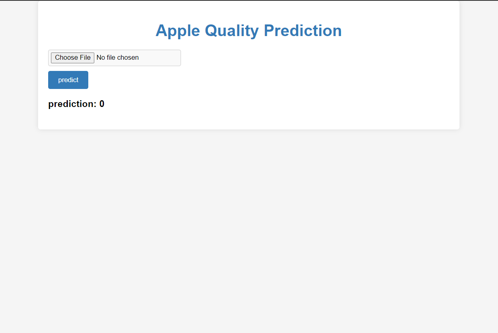

# Bridge Between MATLAB and Python for Fruit Quality Classification

## Description
This project serves as a bridge between MATLAB and Python, focusing on deep learning techniques for the classification of fruit quality. The project involves training a CNN model in MATLAB and further converting it into a TensorFlow model in Python. The trained model is integrated into a Flask web application using HTML and CSS.

## Prerequisites
- MATLAB and Python environments set up.
- Understanding of deep learning concepts and CNN architectures.
- Familiarity with MATLAB, TensorFlow, and Flask.

## Installation
1. Ensure that MATLAB and Python are properly installed on your system.
2. Install the required packages for deep learning in MATLAB and Python.
3. Set up a virtual environment for the Python Flask application.

## work steps
1. Train the CNN model in MATLAB using a comprehensive fruit quality dataset. Ensure the dataset is diverse and representative of various fruit quality characteristics.
2. Convert the trained MATLAB model into a TensorFlow model for integration into the Python environment. Validate the model's performance and accuracy.
3. Develop a Flask web application using HTML and CSS to provide a user-friendly interface for fruit quality classification.
4. Incorporate the TensorFlow model into the Flask application to enable real-time fruit quality classification for users.

## Result

Provide an image that showcases the web application interface and the fruit quality classification results. Ensure that the image accurately represents the user experience and the classification accuracy.